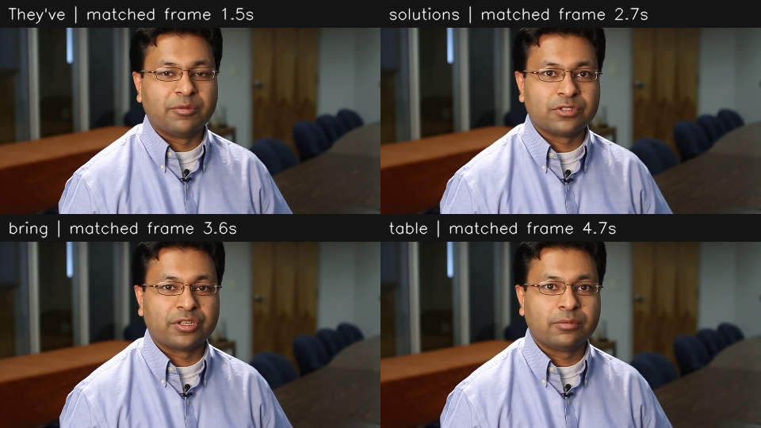

# 问题1：100条原始视频的特征提取与时序对齐

## （1）特征提取与时序对齐整体方案

以每条视频的原始时间轴为共同时间基准。先读取附件1的英文转写和视频、音频，再把文本、语音和视觉表示汇总到同一词序列。输出的第 *i* 行始终对应第 *i* 个转写词及其 `[开始秒, 结束秒)` 区间；任何缺失或近似回退都用有效掩码和方法字段单独标出。

文本使用 `google-bert/bert-base-uncased` 的 768 维上下文表示。分词后按 WordPiece 字符位置归并到原转写词，不把一个词拆成多行。语音使用 `facebook/wav2vec2-base-960h` 提取每词 768 维上下文表示，并提取 74 维可解释声学量：40维 log-Mel、13维 MFCC、13维 MFCC差分，以及 RMS、过零率、基频、浊音标记、谱质心和韵律差分。帧移为 10 ms。音频按 16 kHz 单声道处理。

视觉按 10 帧/秒抽样。MediaPipe Face Landmarker 提供 52 维面部动作形变系数；ResNet-18 ImageNet 表示为 512 维，另提取 49 维 LBP 和区域亮度。MediaPipe 未检出人脸时，OpenCV Haar 框只用于裁出人脸外观，不能生成 blendshape；相应有效掩码保持无效。视觉特征在词的 `[开始,结束)` 区间内取均值；区间内没有采样帧时，才使用离词中点最近的一帧，并记录回退标记。

语音时序通过 wav2vec2 的 CTC 输出对照题目给定转写做字符级 Viterbi 强制对齐，再将字符边界归并成词边界。平均字符 log 概率低于 -3.0、无法构造 CTC 路径时，按词长比例分配到检测出的有效语音范围并标为“低置信回退”；静音音轨标为音频缺失，时间只按整段视频比例分配。回退时间不是精确人工标注，使用模型时应降低权重或屏蔽。

处理流程为：检查并读取100条清单 → 找到对应原始视频 → 解码单声道音频并统计有效时长 → 生成词级文本表示 → 计算音频表示并做 CTC 对齐 → 10 fps 抽帧、检测人脸并生成视觉表示 → 以词区间对三类特征池化 → 保存逐词数组、掩码、置信度和来源 → 对全部样本做结构与路径审计。这里的“标准化”指统一采样率、秒级时间轴、词序、特征维数和缺失标记；不使用这100条数据去拟合跨样本均值方差，避免把测试分布信息带入后续训练。若后续分类器需要 Z-score，应只在每个训练折上拟合标准化参数，再用于对应验证/测试折。

## （2）特征文件规范与100条结果

全量文件位于 `outputs/问题1_全量特征结果/`，其中 `问题1_全量特征文件_提交版.zip` 可直接作为附件提交。每条样本一个压缩 NPZ 文件，命名为 `video_id__clip_id.npz`。主要数组为：`words`（N个词）、`word_times`（N×2秒）、`text`（N×768）、`audio`（N×74）、`audio_wav2vec`（N×768）、`vision`（N×49）、`face_blendshapes`（N×52）、`vision_resnet18`（N×512）。其中 N 是该片段转写词数。另有 `valid_length`、`sequence_position`、`valid_mask`、`padding_mask` 及各模态有效掩码、CTC 置信度和视觉帧时间；序列没有填充，`padding_mask` 全假。无效 blendshape 行为零并由掩码说明。

逐词 CSV 位于 `word_alignment/`，记录原词、字符位置、起止秒、对齐方式、帧数、置信度、人脸框及最近抽样视频帧时间。`sample_manifest.csv` 保存机器可读的逐样本明细；`问题1_100条样本特征汇总.csv` 用中文列出题目要求的样本编号、模态、有效时长、各模态维度、对齐粒度和文件位置。100条共生成1934个词级记录，所有样本均有特征文件。

在 Python 中读取示例：

```python
import numpy as np
from pathlib import Path

p = Path("outputs/问题1_全量特征结果/features/-3g5yACwYnA__13.npz")
with np.load(p, allow_pickle=False) as d:
    print(d["words"], d["word_times"].shape, d["text"].shape)
    print(d["audio"].shape, d["vision"].shape)
    keep = d["valid_mask"] & d["audio_valid"]
```

## （3）典型样本时序验证

选取 `-3g5yACwYnA__13`。其原转写为：“They've been able to find solutions or at least bring some answers to the table.”；音视频有效时长均为 5.3991 秒。下面几个词展示文本、语音区间和视频帧如何落到同一词序号。语音帧数是该词区间内的 10 ms 声学帧数；视频时间是最近的 10 fps 抽样帧。各行的三类表示分别写入 NPZ 对应行。

|词|语音起止秒|声学帧数|对应视频帧时间|人脸/动作有效|对齐置信度|
|---|---:|---:|---:|---|---:|
|They've|1.4451–1.6057|16|1.5|人脸及52维动作有效|-0.03358|
|solutions|2.4487–2.9304|49|2.7|人脸及52维动作有效|-0.03332|
|bring|3.4723–3.7332|26|3.6|人脸及52维动作有效|-0.22446|
|table|4.6164–4.8773|26|4.7|人脸及52维动作有效|-0.00535|

图中给出与词区间匹配的代表帧。完整逐词边界见 `word_alignment/-3g5yACwYnA__13.csv`，中文摘录见 `问题1_典型样本逐词对齐示例.csv`；每个词的文本768维、语音74+768维、视觉52+512+49维表示在 NPZ 中以相同词序索引对应。



## （4）复现方法与质量核验

本次运行环境：Python 3.12.13、PyTorch 2.9.0+cu128、TorchAudio 2.9.0、Transformers 4.57.6、OpenCV 4.11.0、MediaPipe 0.10.21、TorchVision 0.24.0。使用模型为 BERT-base-uncased、wav2vec2-base-960h、MediaPipe Face Landmarker float16 任务模型及 ImageNet 预训练 ResNet-18；任务模型 SHA-256 和标签表 SHA-256 记录在 `model_and_environment.json`。

在项目目录准备官方附件数据与 FFmpeg，按 `README_Q1.md` 建立依赖环境并下载预训练权重；然后运行：

```bash
python q1_feature_extract.py --data-root "E题数据/E题数据" \
  --out "outputs/问题1_全量特征结果" --visual-fps 10
python audit_q1_outputs.py --data-root "E题数据/E题数据" \
  --out "outputs/问题1_全量特征结果"
```

本次结果审计覆盖100/100条样本、1934个词级记录，未发现缺失特征文件、时间表与 NPZ 不一致、无效 blendshape 非零或绝对路径泄漏，审计通过。平均词级人脸检测率为90.5%，blendshape 有效率为76.4%；21条样本触发低置信或静音时间回退，对应15.6%的词行使用近似时间；另有9.4%的词区间需要最近视频帧回退。音频缺失样本为2条。以上比例表明结果具备全量覆盖和可追溯性，但回退词仍需结合原视频抽查，不能作为人工精标时间。

这些表示是通用预训练特征和面部动作描述，不等同于训练完成的情绪分类器，也不保证竞赛名次。题目第1问提供的特征工程结果可用于呈现完整提取与对齐流程；后续问题还应按其指定附件、划分和指标独立训练与验证。
